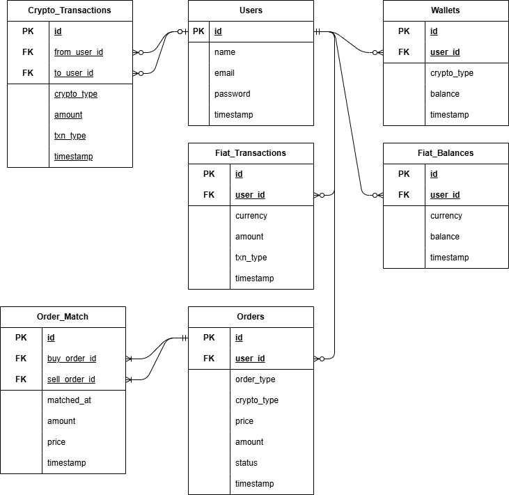

# Backend

## Tech Stack

- Node.js + Express
- PostgreSQL
- Docker + Docker Compose
- Argon2

---

## ER Diagram



## Postman Collection

ไฟล์ Postman Collection: [`crypto.postman_collection.json`](postman/crypto.postman_collection.json)

---

## วิธีใช้งาน

### 1. สร้างไฟล์ `.env`

```env
PORT=3000
DB_HOST=db_postgres
DB_PORT=5432
DB_USER=crypto_admin
DB_PASSWORD=P@ssw0rd1234
DB_NAME=crypto_exchange_db
```

### 2. รันโปรเจกต์ด้วย Docker

docker compose up --build
API ใช้งานที่: http://localhost:3000

### 3.หลังจาก docker compose up แล้วรัน seed

docker exec -i db_postgres psql -U $DB_USER -d $DB_NAME < sql/seed.sql
